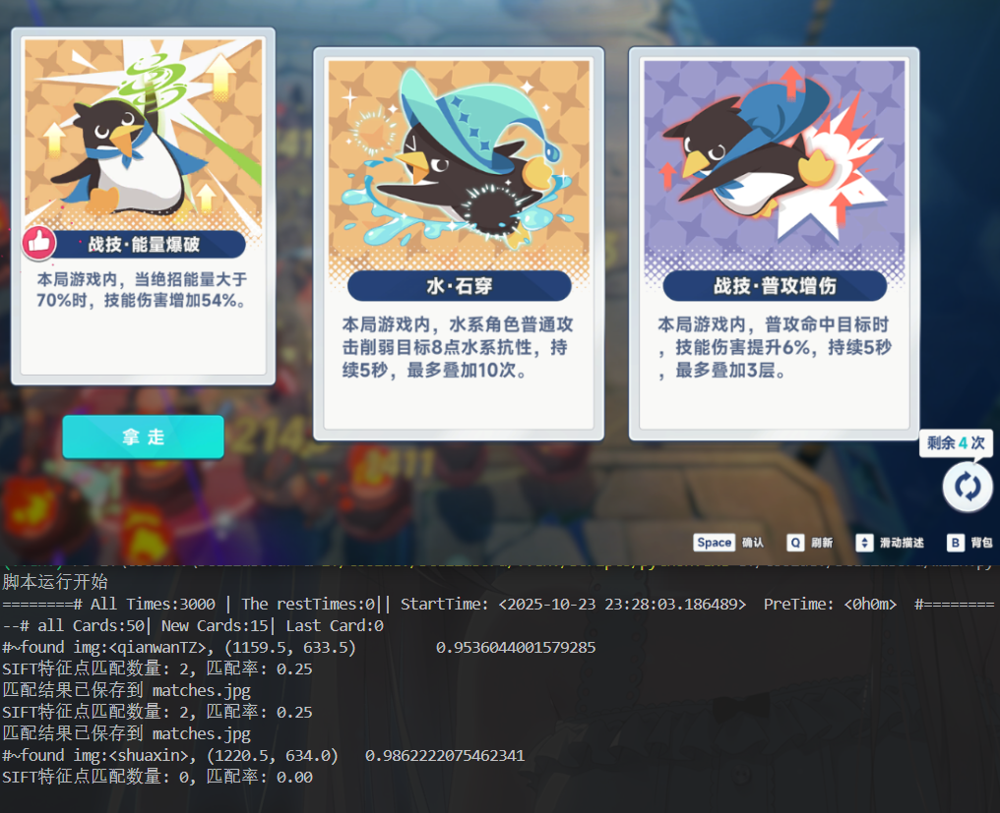

# **星塔旅人自动刷图鉴脚本**

目前仅仅实现了自动刷灾变防线的图鉴，且仅限于打不过失败的情况下。

bug极其多，初版自用。

## 开发计划

* [X] 实现单一图的初步循环刷图鉴
* [ ] 修复bug，加入重启游戏等功能，提高稳定性
* [ ] 实现自动切换多图刷取图鉴

## 安装方法：

1. 安装python 3.10版本
2. 下载整个项目
3. 下载requirements.txt的依赖

## 使用方法：

1. 使用mumu12模拟器，打开星塔旅人，进入灾变防线前往挑战界面
2. 修改config.json文件中模拟器的adb地址
3. 启动main.py

---

**运行截图：**

